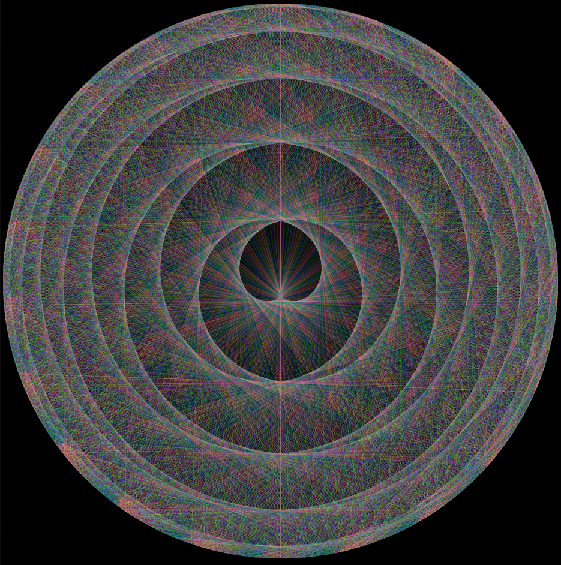

# Circular-Tables
Another way to see multiplication tables with a defined amount of multiplicator but with infinite possibilities...





## Install
* Clone this repository:
```
git clone https://github.com/italogfernandes/xablaus.git
```


## Running:

* Just launch MT.html with your browser


## License

This project is licensed under the MIT License - see the [LICENSE.md](LICENSE.md) file for details


## Authors

* **Gaetan Davout**
